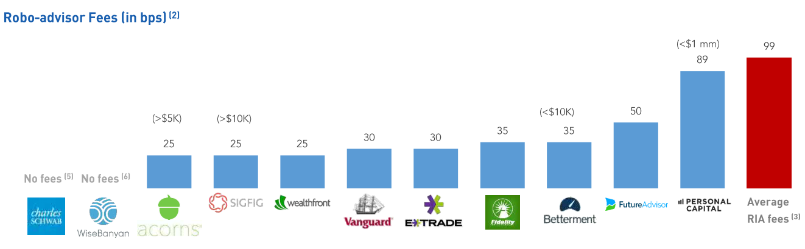

# Fintech-Case-Study-2020
Brief presentation of a Fintech Company
## Overview and Origin
​
* Name of company
    * Wealthfront
* When was the company incorporated?
    * 2008 
* Who are the founders of the company?
    * Andrew Rachleff – Chairman, CEO
    * Daniel Caroll – Founder, CSO

* How did the idea for the company (or project) come about?
    * Andrew recognized that there is a need to democratize access to sophisticated investment products
    * Andy also found that even the best-managed endowments in the world relied on spreadsheets, outdated tools, and manual calculations. It turned out that even high-end investors needed an upgrade. He recognized that Software could make investing easier and better for more people.
    * Daniel realized that to most people didn’t have access to good financial advice. So he started tinkering with a few solutions. He eventually built a prototype that got some traction, and even got the attention of a lecturer at Stanford.
    * Thats when Andrew and Daniel met.
​
* How is the company funded? How much funding have they received?
    * 6 Funding rounds
    * total funding amount is 204.5 million
    * first round in 2008 (Angel round), latest round was in January 2018 (Series E)
    https://www.crunchbase.com/organization/wealthfront#section-funding-rounds

## Business Activities:
* What specific financial problem is the company or project trying to solve?
    * Wealthfront is a privately owned investment manager, providing automated financial planning and banking services. Wealthfront invests in public equity, fixed income markets, mutual funds, and exchange traded funds. It also invests in real estate and natural resources.​
    * Wealthfront's Services comprise: Services: Free Financial Planning, Tax-loss Harvesting, Stock-Level Tax Loss Harvesting, Single Stock Diversification, Smart Beta, Risk Parity, Portfolio Line of Credit, Referral Program Rewards, Third-Party Account Support, College Savings Plan, Mobile App 

* Goal/Mission: 
    * Mission is to deliver sophisticated financial advice to everyone, through expert crafted software.
* Who is the company's intended customer?  Is there any information about the market size of this set of customers?
    1. Customers: people who have not access to good financial advice, people who want to save for certain milestones/events in their lives: Home buying, retirement, college, travel
    2. Customers, who dont need the personal contact to an advisor to make investment decision 
* What solution does this company offer that their competitors do not or cannot offer? (What is the unfair advantage they utilize?)
    * Through the software (technology), Wealthfront is able to offer a a very low-cost alternative to classic financial avisory for individuals. It is characterized by:
        1. Low or no minimum investment requirement
        2. Low or no management fee
        3. Immediate accessability (via movile app)
* Which technologies are they currently using, and how are they implementing them? (This may take a little bit of sleuthing–– you may want to search the company’s engineering blog or use sites like Stackshare to find this information.)
    1. Front End
        * application server is a JRuby on Rails web server and our client-side application is built using React, Redux and D3
        * utomated testing infrastructure uses a variety of frameworks and libraries including Jest, Sinon, Chai, RSpec and Capybara
    2. Back End
    * Java or similar language (such as C++ or C#)
    * Offline data stores (preferably Hadoop stack) 
    3. Data Platform
    * SQL
    * Machine learning technologies (Spark, Tensorflow, AirFlow, SageMaker etc.
​
## Landscape:
​
* What domain of the financial industry is the company in?
    * Robo-Advisor in Wealth Management, Investment Advisory (RIA), Wealth-Tech
​
* What have been the major trends and innovations of this domain over the last 5-10 years?
    * Increase in AuM: After suffering through the global recession of 2008-2009, the asset management industry has recovered and is growing. expected to reach $101.7 trillion (by 2020, CAGR of ~6%); this market presents numerous opportunities for both incumbents and disruptors to grow and capture market share.
    * Downward pressure in advisory fees and increased reporting requirements
    * Aging population leading to more generational wealth transfer
    * Millenials, generation x and have different investing habits than previous generations
    * Trend from active investment strategies to more passive investment strategies (index funds, ETFs) as fewer active managers beat their benchmarks (therefore do not justify their fees)
* What are the other major companies in this domain?
    1. Wealthfront
    2. Betterment
    3. Future Advisor / Black Rock
    4. Ellevest
    5. Acorns
    6. Wealth Managers / Brokers who develop their own robo advisors:
        * Charles Schwab
        * E-trade
        * UBS
        * BoA

## Results
​
* What has been the business impact of this company so far?
    * Wealthfront manages currently around $13bn in Assets
    * Wealthfront takes the work done by old-fashioned human financial advisers and uses algorithms to perform it instead
    * Millennials investing passively --> Passive investing revolution
        * Rather than pay a financial professional large amounts of money to pick securities for them, passive investors simply pay a very modest fee to buy a broad, predetermined, diversified basket of stocks. It’s easier, it’s much cheaper, and it almost always outperforms the active investors over the long term.
​
* What are some of the core metrics that companies in this domain use to measure success? How is your company performing, based on these metrics?
    * Assets under Management
    
    * Number of accounts
    
    * MANAGEMENT FEES
    
    * Account minimums and account types (401k etc.)

* How is your company performing relative to competitors in the same domain?

    * Accross the pure robo-advisors, Wealthfront is at the top together with Bettergront in terms of Assets under Management, however most assets in the US aare still; managed by banks and other asset managers
​
​
## Recommendations
​
* If you were to advise the company, what products or services would you suggest they offer? (This could be something that a competitor offers, or use your imagination!)
    * In order to drive business growth,  Wealthfront should consider adding more products to their portfolio (lending etc.) 
* Why do you think that offering this product or service would benefit the company?
    * Wealthfront's key customer base (<45 age) ages and their lifes become more complex, which require more complex products (mortgage, private loans, credit cards, insurance etc.) 
    * In the longer run it would help to retain customers (increase customer stickyness = valuable relationships)
​
* What technologies would this additional product or service utilize?
    * A lending platform would have to be created. Wealthfront can also collarborate woth existing (alternative) lenders in this space (Sofi, Lendingtree, Laurel Road Bank)
​
* Why are these technologies appropriate for your solution?

    * Current lending platforms are easy to use and provide instant quotes as well as overnight approvals
    * Significant volume of loans can be originated

### Sources
1. https://www.wealthfront.com/
2. https://riabiz.com/a/2019/4/26/wealthfront-adds-staggering-1-billion-to-its-robo-bank-in-less-than-a-month-but-critics-say-its-treading-the-line-again-on-possible-conflicts-of-interest
3. https://www.wired.com/story/beware-roboadvisors-wealthfront-betterment/
4. https://www.nerdwallet.com/best/investing/robo-advisors
5. https://www.financialsamurai.com/largest-robo-advisors-by-assets-under-management-aum/
6. https://www.roboadvisorpros.com/robo-advisors-with-most-aum-assets-under-management/
7. https://www.ftpartners.com/wealth-technology-report

